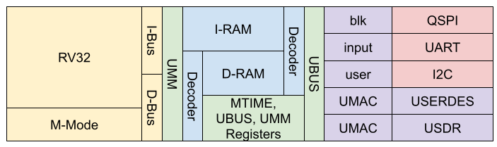
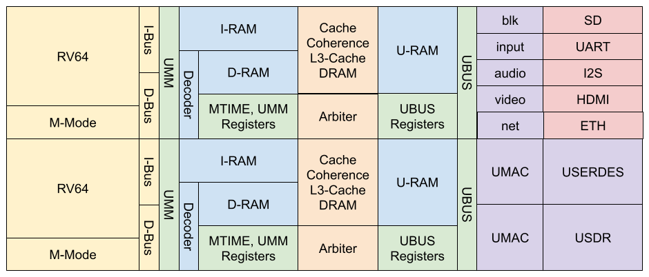

# USoC: An IoT SoC for a WASM userspace.

<!--[](#)
[](#)
[](#)-->



- **UMM** is a memory management unit designed for a wasm user space. It handles
wasm linear memory bounds checking and mapping wasm 64KB pages into physical
ram. Because the table is sized for `MAX_RAM / 64KB`, context switches don't
require TLB flushing. Its just four additional registers to swap in addition
to CPU registers and PC.
- **UMAC** is a unified MAC. By focusing on CRC checking and retransmissions and
using a PHY agnostic PIPE interface, it does only what a MAC should do.
- **UBUS** is our DMA controller. It routes packets to the peripheral FIFO
queues based on flow credits and negotiated time slices.
- **USYS** is a formally verified, completely arbitration-free system fabric. Since
all peripherals use a packet based FIFO interface, drivers can be written in
wasm user space.
- **USoC** is the SoC, integrating an RV32IM core and targeting ice40/ecp5 fpga's.

## 🗺️ The Horizon: Designed to Scale

While we are laser-focused on finalizing the Phase 1 MVP, the USYS fabric was
architected from day one to scale.



Our internal blueprints detail a clear evolutionary path from this single-core
edge node to a multi-core, cache-coherent SMP cluster.

## 🛰️ Follow the Journey & Progress Reports

This project is being designed, formally verified, and blogged about in real
time. If you want to see the dirty details of how the SoC and microkernel are
being built, follow along:

* **Read the deep-dives on the Blog:** [https://craven.ch]
* **Follow live progress updates:** [https://x.com/dvc94ch]

## 🛠️ Getting Started

You'll need some dependencies like yosys, nextpnr, sby, yices and gtkwave. Once
you have your toolchain ready you can clone and run formal verification and
timing tests yourself.

```bash
git clone https://github.com/axiom-factory/usys
cd usys
pixi install
pixi shell
```

Every component is in its own file and can be formally verified by running
it in python.

```
python usys/wishbone/fabric.py
```

Timing requires a wrapper to ensure all the inputs and outputs are driven
and yosys doesn't just optimize the design away.

```
python usys/wishbone/fabric_timing.py
```

## Licensing & Third Party Contributions
Copyright (C) 2026 David Craven. All rights reserved.

This gateware is dual-licensed. You may use it under the terms of:
1. The GNU General Public License v3.0 (see LICENSE-GPL.txt)
    OR
2. A commercial license obtained directly from `david@craven.ch`.

If you wish to use this IP in a proprietary product without disclosing
your top-level RTL source code, you must purchase a commercial license.

Shipping a binary bitstream, flashing an EEPROM on a sold PCB, or distributing
an ASIC containing IP from this repository counts as "distribution" under my
interpretation of the GPL.

At this time we do not accept external contributions due to not having a
CLA. Please open issues if you encounter a bug, and if there is a serious
commercial interest in contributing, contact me at `david@craven.ch` so we
may discuss creating a CLA.

